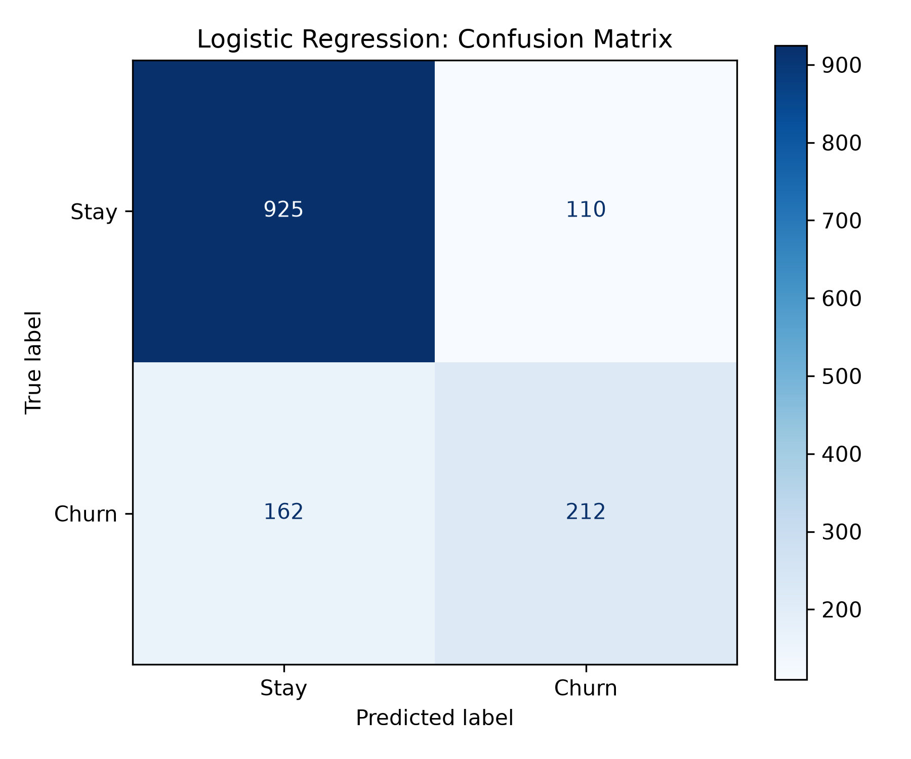
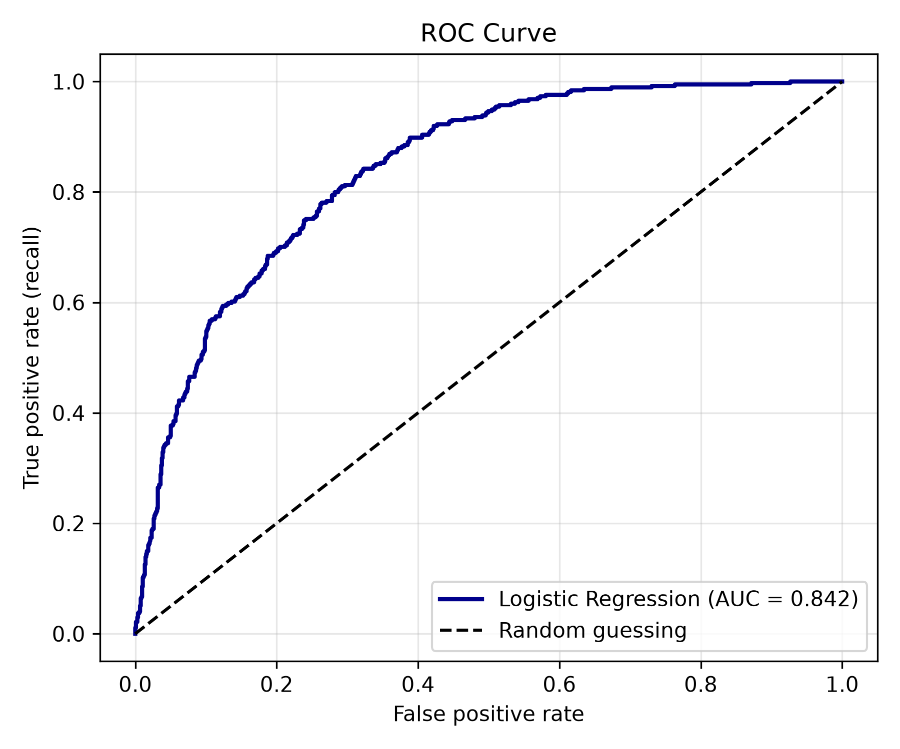
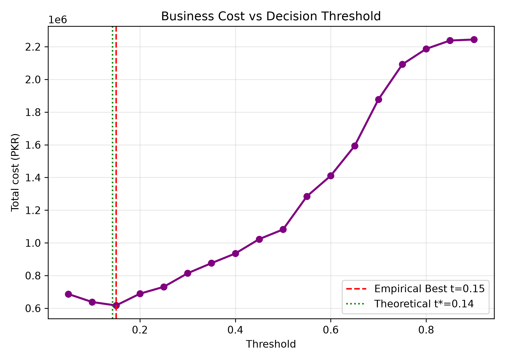
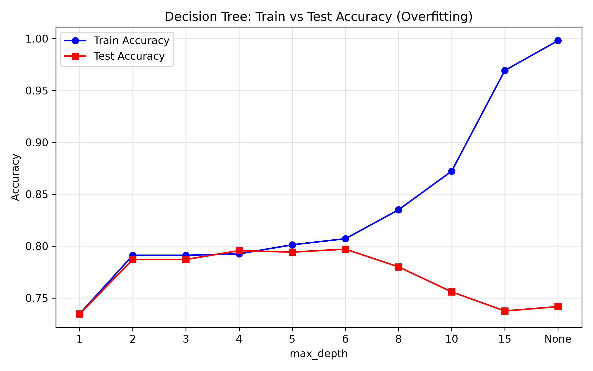

# Customer Churn Prediction
## Week 1: Exploratory Data Analysis

Loads, cleans, analyzes, and visualizes customer churn data to identify 
patterns and relationships between customer features and churn.

### Dataset
- Source: Telco Customer Churn (Kaggle)
- Size: 7,043 customers, 21 features
- Target: Predict customer churn (Yes/No)

### Tools Used
- Python (Pandas, NumPy)
- Matplotlib, Seaborn
- Kaggle Notebooks

## High-Risk Customer Characteristics

### Contract Type
- Month-to-month customers show the highest churn risk.
- Customers with one-year or two-year contracts are more likely to stay.

### Tenure
- Customers with shorter tenure churn more often.
- Long-term customers show greater retention.

### Monthly & Total Charges
- Higher monthly charges are linked with higher churn.
- Total charges are strongly related to tenure.

### Services
- Fiber optic internet customers show a higher churn rate.
- Customers without Online Security / Tech Support are higher-risk.

### Payment Method
- Electronic check users show the highest churn rate.
- Automatic payment methods are associated with better retention.

## Patterns Observed
1. Overall churn rate is approximately 26.5% (1,869 churned out of 7,043 customers).
2. Contract length is strongly related to churn behavior.
3. Tenure and total charges are naturally related.
4. Payment method and internet service type both show clear churn patterns.

### Setup
Open the Kaggle notebook or run locally:
```
pip install pandas numpy matplotlib seaborn
```

## Week 2: Building ML Models

- Baseline (always "stay"): accuracy 73.5%
- Best model: Logistic Regression, AUC 0.842, recall 92.0% at threshold 0.15
- Top churn drivers (permutation importance): tenure, TotalCharges, Contract_Two year
- Threshold chosen: 0.15, because under asymmetric business costs (PKR 6,000 for a missed churner vs. PKR 1,000 for an unneeded retention incentive), decision theory indicates $t^* = \frac{C_{FP}}{C_{FP} + C_{FN}} \approx 0.14$; empirical optimization at $t = 0.15$ catches 132 extra churners and saves PKR 465,000 in net business costs
- Engineered features: n_services, is_new, charge_per_mo, price_jump; effect on AUC: 0.8422 -> 0.8420 (no improvement, as tree ensemble splits already capture non-linear interactions)
- Biggest lesson: High accuracy on imbalanced data is dangerously deceptive, and the classification decision threshold is an economic business decision rather than a statistical default of 0.5.

### Model Benchmark Comparison Table

| Model | Accuracy | Precision | Recall | F1-Score | ROC-AUC |
| :--- | :---: | :---: | :---: | :---: | :---: |
| **Baseline (Majority Class)** | 0.735 | 0.000 | 0.000 | 0.000 | 0.500 |
| **Logistic Regression (Default t=0.5)** | **0.807** | 0.658 | 0.567 | 0.609 | **0.842** |
| **Logistic Regression (Balanced Weights)** | 0.739 | 0.505 | 0.781 | 0.613 | 0.841 |
| **Decision Tree (Regularized, d=5)** | 0.796 | 0.632 | 0.551 | 0.589 | 0.829 |
| **Random Forest (300 Trees, OOB=0.803)** | **0.807** | **0.673** | 0.529 | 0.593 | **0.842** |

### Key Business Insights
1. **The Cost of Default Thresholds:** At $t=0.50$, Logistic Regression misses 162 churners, incurring PKR 1,082,000 in financial loss. Shifting the threshold to $t=0.15$ based on business costs cuts net losses to PKR 617,000—a **43% savings (PKR 465,000 saved)**.
2. **Top Protective vs. Risk Factors (Odds Ratios):**
   - **Tenure (OR: 0.295):** 1 SD increase cuts churn odds by ~70.5%.
   - **Two-Year Contract (OR: 0.555):** Cuts churn odds by ~44.5% compared to month-to-month.
   - **Fiber Optic Internet (OR: 2.179):** More than doubles the odds of churn (+117.9%), pointing to serious pricing or service reliability friction.
3. **Decision Tree Overfitting:** Decision trees exhibit severe overfitting beyond depth 5–6. At unconstrained depth (`None`), training accuracy reaches 99.8% while test accuracy collapses to 74.2% (a 25.6% generalization gap).

### Visualizations & Diagnostics

<p align="center">
  
  
</p>

<p align="center">
  
  
</p>
